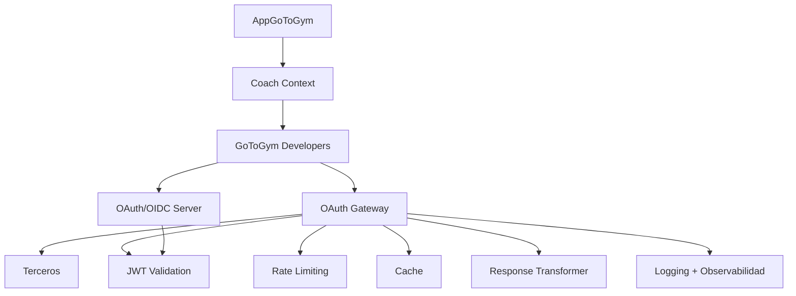
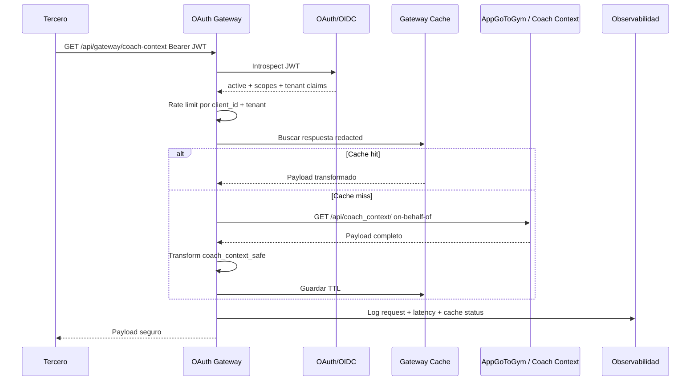
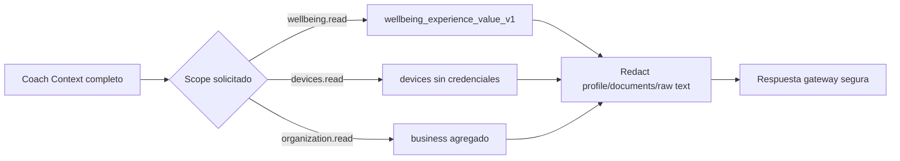

# API Gateway para GoToGym Developers

## Arquitectura objetivo

```text
AppGoToGym
↓
Coach Context
↓
GoToGym Developers
↓
OAuth Gateway
↓
Terceros
```

GoToGym Developers debe operar como una capa BFF/API Gateway entre AppGoToGym y terceros. El gateway centraliza autenticacion OAuth, validacion de scopes, rate limiting, logging, caching, observabilidad y transformacion de respuestas antes de exponer datos sensibles.

## Analisis del repositorio actual

El repositorio ya contiene piezas base:

- `frontend/src/services/wellbeingService.ts` consume `/api/coach_context/` directamente desde la API configurada por `VITE_API_URL`.
- `backend/src/services/corporate-wellbeing.service.ts` ya funciona como proxy hacia `https://api.gotogym.store/api/business/wellbeing/corporate/`.
- `docs/COACH_CONTEXT_ENDPOINT_MAP.md` define el contrato funcional de Coach Context y sus guardrails.
- `backend/src/api/middlewares/oauth.middleware.ts` valida access tokens OAuth con introspeccion.
- `backend/src/services/oauth.service.ts` emite e introspecta JWT OAuth/OIDC.
- No existia una capa transversal para rate limit, logging, cache, transformacion y observabilidad.

## Gateway propuesto

Responsabilidades:

- Exponer endpoints externos bajo `/api/gateway/*`.
- Validar JWT OAuth emitido por GoToGym Developers.
- Enforzar scopes `profile.read`, `wellbeing.read`, `metrics.read`, `analytics.read`, `organization.read`, `devices.read`, `documents.read`.
- Resolver tenant desde claims OAuth: `tenant_id`, `organization_id`, `client_id`, `sub`.
- Llamar AppGoToGym/Coach Context usando estrategia on-behalf-of o token vault.
- Transformar payloads para terceros, removiendo datos personales no necesarios.
- Cachear respuestas seguras y agregadas.
- Auditar y observar cada request.

## Rate limiting

Politica inicial:

| Tipo de endpoint | Ventana | Limite | Clave |
| --- | --- | --- | --- |
| Coach Context seguro | 60s | 60 req | `client_id + tenant_id + path` |
| Metricas | 60s | 120 req | `client_id + tenant_id + path` |
| Analitica agregada | 60s | 30 req | `client_id + organization_id + path` |
| Introspeccion/revocacion | 60s | 60 req | `client_id + path` |

Implementacion base:

```txt
backend/src/gateway/middlewares/rate-limit.middleware.ts
```

## Logging

Cada request registra:

- `requestId`
- `routeId`
- `method`
- `path`
- `statusCode`
- `durationMs`
- `clientId`
- `tenantId`
- `organizationId`
- `cacheStatus`

Implementacion base:

```txt
backend/src/gateway/middlewares/request-logging.middleware.ts
backend/src/gateway/services/observability.service.ts
```

## Caching

Cache inicial en memoria, reemplazable por Redis:

| Payload | TTL | Vary by | Observacion |
| --- | --- | --- | --- |
| Coach Context seguro | 60s | tenant, subject, scopes, query | Solo contrato redacted. |
| Bienestar corporativo | 300s | organization, scopes, query | Solo agregado. |
| JWKS | 300s | global | Puede vivir en edge/CDN. |

Implementacion base:

```txt
backend/src/gateway/cache/memory-cache.ts
```

## Observabilidad

Senales minimas:

- Tasa de errores por upstream.
- Latencia p50/p95 por ruta.
- Cache hit ratio.
- Rate limit rejections.
- JWT invalid/expired/revoked.
- Upstream timeout.
- Transform errors.

Primera version:

```txt
backend/src/gateway/services/observability.service.ts
```

Produccion:

- OpenTelemetry traces.
- Azure Application Insights.
- Logs JSON estructurados.
- Alertas por `5xx`, `upstream_timeout`, `high_latency`, `rate_limited`.

## Validacion JWT

El gateway valida JWT OAuth con:

```ts
requireGatewayJwt('wellbeing.read')
```

La validacion debe comprobar:

- Firma `RS256`.
- `iss`.
- `exp`.
- `jti` no revocado.
- `token_use=access`.
- `scope` requerido.
- `tenant_id` y `organization_id` presentes.

## Transformacion de respuestas

Transformaciones iniciales:

| Transform | Entrada | Salida |
| --- | --- | --- |
| `coach_context_safe` | `/api/coach_context/` | `wellbeing_experience_value_v1`, `devices`, `business`, guardrails. |
| `corporate_wellbeing` | `/api/business/wellbeing/corporate/` | Resumen agregado, workspace y analisis corporativo. |
| `passthrough` | Payload no sensible | Sin cambios. |

Implementacion base:

```txt
backend/src/gateway/services/response-transformer.ts
```

## Estructura de carpetas

```txt
backend/src/gateway/
  cache/
    memory-cache.ts
  middlewares/
    gateway-jwt.middleware.ts
    rate-limit.middleware.ts
    request-logging.middleware.ts
  services/
    observability.service.ts
    response-transformer.ts
    upstream-client.ts
  types/
    gateway.types.ts
```

Siguiente paso recomendado:

```txt
backend/src/gateway/routes/
  coach-context.gateway.routes.ts
  corporate-wellbeing.gateway.routes.ts
  metrics.gateway.routes.ts
```

## Mermaid: arquitectura



## Mermaid: request de tercero



## Mermaid: transformacion segura



## Estrategia de despliegue

Fase 1:

- Mantener proxy corporativo existente.
- Montar middlewares del gateway en nuevas rutas `/api/gateway/*`.
- Usar cache en memoria solo para desarrollo.

Fase 2:

- Redis para rate limit/cache.
- Token vault para on-behalf-of hacia AppGoToGym.
- OpenTelemetry y Application Insights.

Fase 3:

- Gateway dedicado con WAF/CDN.
- Circuit breakers por upstream.
- Versionado de contratos: `gateway.coach_context.safe.v1`.
