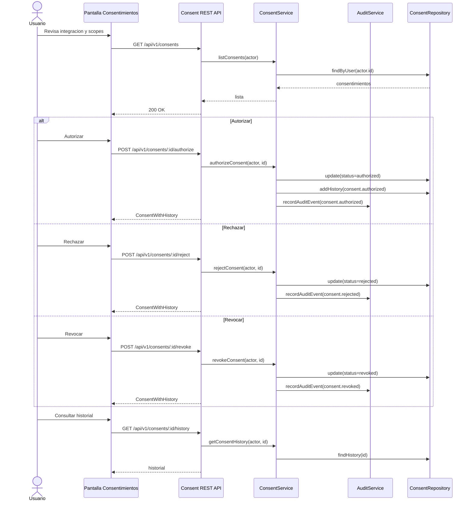

# Consentimientos

## Objetivo

La pantalla Consentimientos permite que un usuario autorice, rechace o revoque el intercambio de informacion con integraciones de terceros. Cada decision queda trazada en historial operativo y eventos de auditoria.

## Modelo de datos

```ts
type ConsentStatus = 'pending' | 'authorized' | 'rejected' | 'revoked';

interface IntegrationConsent {
  id: string;
  userId: string;
  integrationId: string;
  integrationName: string;
  ownerCompany: string;
  requestedScopes: Scope[];
  status: ConsentStatus;
  requestedAt: string;
  authorizedAt?: string;
  rejectedAt?: string;
  revokedAt?: string;
  updatedAt: string;
}

interface ConsentHistoryEvent {
  id: string;
  consentId: string;
  action:
    | 'consent.requested'
    | 'consent.authorized'
    | 'consent.rejected'
    | 'consent.revoked';
  actorUserId: string;
  status: ConsentStatus;
  createdAt: string;
  metadata?: Record<string, unknown>;
}
```

## API REST

| Metodo | Ruta | Descripcion |
| --- | --- | --- |
| GET | `/api/v1/consents` | Lista consentimientos del usuario autenticado. |
| GET | `/api/v1/consents/:id/history` | Devuelve el consentimiento con historial. |
| POST | `/api/v1/consents/:id/authorize` | Autoriza compartir los scopes solicitados. |
| POST | `/api/v1/consents/:id/reject` | Rechaza una solicitud pendiente. |
| POST | `/api/v1/consents/:id/revoke` | Revoca un consentimiento autorizado. |

Todas las rutas requieren `Authorization: Bearer <token>`.

## Eventos de auditoria

| Evento | Cuando se emite | Metadata principal |
| --- | --- | --- |
| `consent.requested` | Se crea una solicitud de consentimiento. | `integrationId`, `integrationName`, `scopes` |
| `consent.authorized` | El usuario autoriza compartir informacion. | `integrationId`, `integrationName`, `scopes` |
| `consent.rejected` | El usuario rechaza una solicitud pendiente. | `integrationId`, `integrationName`, `scopes` |
| `consent.revoked` | El usuario revoca un permiso previamente autorizado. | `integrationId`, `integrationName`, `scopes` |

## Diagrama Mermaid


