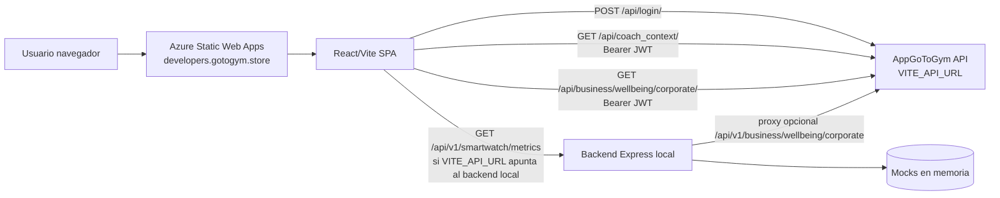
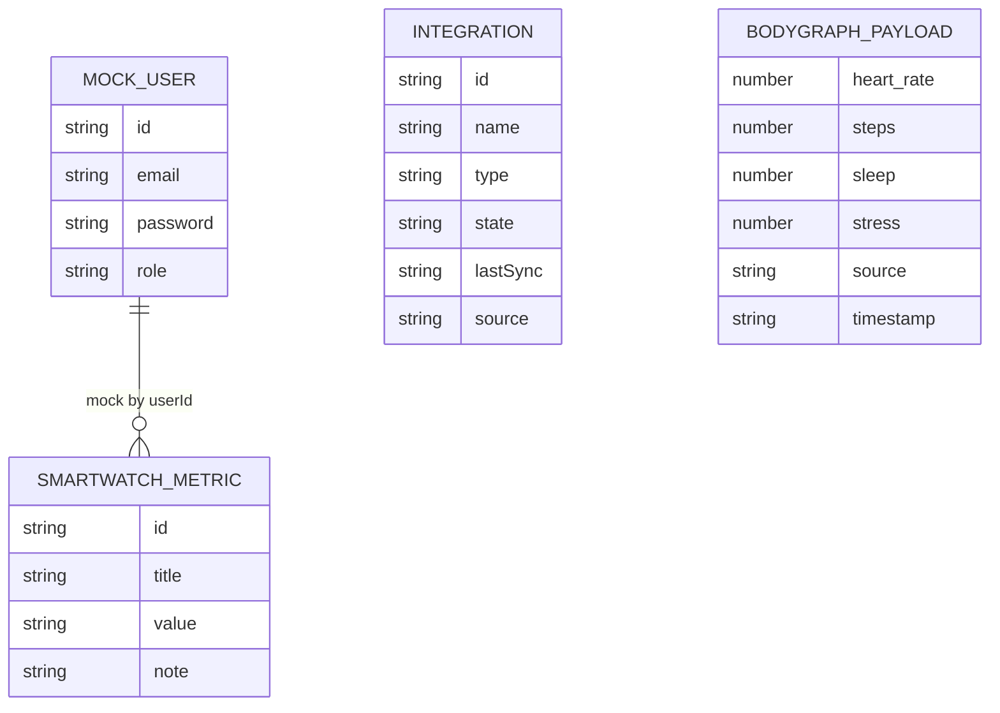
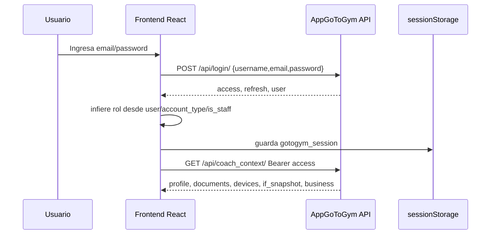
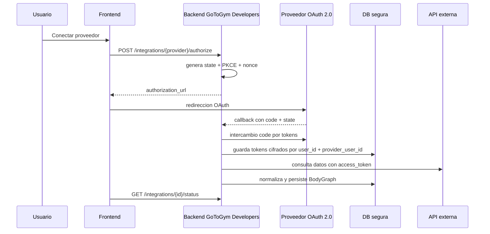

# Informe tecnico de arquitectura, APIs y seguridad

Fecha: 2026-06-10  
Repositorio: GoToGym Developers  
Alcance: analisis estatico de frontend, backend, configuracion, documentacion, rutas, servicios y pruebas.

## 1. Resumen ejecutivo

La solucion es una consola web React/Vite desplegada en Azure Static Web Apps y un backend Node.js/Express/TypeScript con arquitectura por capas. En produccion, el frontend consume principalmente el API productivo de GoToGym configurado mediante `VITE_API_URL`; el backend local de este repositorio existe como modulo API-first, pero el workflow actual solo despliega el frontend.

El sistema maneja dos planos de autenticacion:

- Backend local del repo: `POST /api/v1/auth/login`, JWT firmado con `jsonwebtoken`, usuarios mock.
- Backend productivo AppGoToGym: frontend llama `${VITE_API_URL}/api/login/`, recibe `access`, `refresh` y `user`; luego consume `/api/coach_context/` y `/api/business/wellbeing/corporate/`.

El modelo de datos persistente no esta implementado en este repositorio. Existen modelos TypeScript y repositorios mock para usuarios, integraciones y smartwatch. La informacion real de usuario, documentos, dispositivos, bienestar y empresa viene de AppGoToGym.

## 2. Arquitectura general

### Componentes

- Frontend: React 18, Vite, TypeScript, React Router, Axios, Recharts.
- Backend local: Express 4, TypeScript, CORS, JWT.
- Persistencia local: no hay base de datos activa; `backend/src/config/db.ts` es placeholder.
- Servicios externos: `https://api.gotogym.store`, Azure Static Web Apps, potencial OpenAI segun `.env` y scripts locales.
- Deploy: `.github/workflows/deploy-frontend-swa.yml` compila `frontend/` y publica `frontend/dist`.

### Diagrama arquitectura actual

## 3. Frontend

### Estructura relevante

- `frontend/App.tsx`: inicializa `BrowserRouter`, estado de sesion y logout.
- `frontend/router/AppRouter.tsx`: rutas publicas/protegidas.
- `frontend/router/ProtectedRoute.tsx`: valida autenticacion y roles en cliente.
- `frontend/auth/rbac.ts`: login, sesion, roles, JWT decode en cliente.
- `frontend/src/services/api.ts`: cliente Axios con interceptor Bearer y limpieza en 401/403.
- `frontend/src/services/wellbeingService.ts`: consume `/api/coach_context/`.
- `frontend/src/services/corporateWellbeingService.ts`: consume `/api/business/wellbeing/corporate/`.
- `frontend/hooks/*`: orquestan consumo de APIs y estados.

### Rutas frontend

| Ruta | Acceso |
| --- | --- |
| `/` | Publica |
| `/login` | Publica |
| `/dashboard` | Autenticado |
| `/smartwatch` | Rol `user` |
| `/app-gotogym` | Rol `user` |
| `/cards` | Rol `user` |
| `/business-wellbeing` | Rol `gym` o `admin` |

### Manejo de sesion

- Almacena `gotogym_session` en `sessionStorage`.
- Elimina sesion antigua de `localStorage`.
- Decodifica `exp` del JWT en cliente para cerrar sesion si expiro.
- En 401/403, Axios limpia sesion y redirige a `/login`.

## 4. Backend

### Capas

- `api/routes`: definicion de rutas.
- `controllers`: entrada/salida HTTP.
- `services`: logica de negocio.
- `repositories`: mocks en memoria.
- `models` y `types`: contratos TypeScript.
- `middlewares`: auth y error handler.
- `config`: placeholders de DB y OAuth.

### Endpoints backend local

| Metodo | Endpoint | Proteccion | Entrada | Salida |
| --- | --- | --- | --- | --- |
| POST | `/api/v1/auth/login` | Publico | `{ email, password }` | `{ success, data: { token, role, expiresIn } }` |
| GET | `/api/v1/smartwatch/metrics` | Bearer JWT local | Header `Authorization` | `{ success, data: SmartwatchMetric[] }` |
| GET | `/api/integrations` | Publico | - | `{ success, data: Integration[] }` |
| POST | `/api/integrations/:id/sync` | Publico | `id` path | `{ success, data: SyncResult }` |
| GET | `/api/bodygraph/:integrationId` | Publico | `integrationId` path | `{ success, data: BodyGraph }` |
| OPTIONS | `/api/v1/business/wellbeing/corporate` | Publico CORS | - | 200 |
| GET | `/api/v1/business/wellbeing/corporate` | Bearer reenviado | Header Bearer, query `org`, `days` | `{ success, data: CorporateWellbeingResponse }` |

## 5. Base de datos y modelo de datos

No hay base de datos implementada. `DB_URI` existe como placeholder. Los repositorios retornan datos en memoria.

### Modelo local actual

### Modelo real inferido desde AppGoToGym

El endpoint `/api/coach_context/` documenta entidades reales: `profile`, `documents`, `devices`, `if_snapshot`, `business`, `wellbeing_experience_value_v1`.

Relaciones esperadas:

- Usuario tiene perfil.
- Usuario tiene documentos.
- Usuario tiene dispositivos/proveedores conectados.
- Usuario tiene respuestas IF y registros de bienestar.
- Usuario puede pertenecer a una o varias organizaciones/workspaces.
- Organizacion tiene miembros, roles, plan y permisos.

## 6. Autenticacion y autorizacion

### Flujo de autenticacion actual

### Tecnologia

- JWT Bearer.
- Refresh token recibido pero no existe flujo de refresh implementado en frontend.
- Sesion de navegador mediante `sessionStorage`.
- No hay OAuth 2.0 implementado; `oauth.ts` es placeholder.
- No hay API key para usuarios finales.

### Roles

Roles locales: `user`, `gym`, `admin`.

- `user`: smartwatch, app-gotogym, cards.
- `gym`: dashboard y bienestar corporativo.
- `admin`: dashboard, bienestar corporativo, menu admin.

Riesgo: la autorizacion de rutas es cliente-side. Debe replicarse y forzarse en backend/API productiva.

## 7. Integraciones existentes

### Internas/mock

- HealthKit, HealthConnect, Garmin, Fitbit, ManualInput como mocks.
- `POST /api/integrations/:id/sync` simula sincronizacion en memoria.
- `GET /api/bodygraph/:integrationId` genera payload aleatorio.

### Externas reales

- AppGoToGym API:
  - `/api/login/`
  - `/api/coach_context/`
  - `/api/business/wellbeing/corporate/`
- Azure Static Web Apps.
- OpenAI aparece en `.env`, `package.json`, `test-openai.js` y docs, pero no esta integrado en runtime principal.

### Webhooks y mensajeria

No se encontraron webhooks, colas, pub/sub ni mensajeria asincrona.

## 8. Flujo de integracion segura con terceros recomendado

### Identificadores unicos recomendados

- `user_id` interno inmutable UUID/ULID.
- `organization_id` interno UUID/ULID.
- `membership_id` para relacion usuario-empresa.
- `provider_connection_id` para cada conexion externa.
- `provider_user_id` del tercero, nunca usar email como clave primaria.
- `integration_id`, `sync_job_id`, `event_id`.
- `token_family_id` para rotacion y revocacion de refresh tokens.
- `audit_event_id` para trazabilidad.

## 9. Seguridad

### Controles presentes

- CORS restringido a `developers.gotogym.store` y `localhost:5173` en backend local.
- `Authorization: Bearer` para smartwatch y proxy corporativo.
- Interceptor frontend para anexar token.
- Redireccion a login en 401/403.
- `sessionStorage` en lugar de `localStorage`.
- Headers SWA: `X-Content-Type-Options`, `X-Frame-Options`, `Referrer-Policy`.

### Riesgos detectados

1. Credenciales mock y password plano en repositorio.
2. `JWT_SECRET` tiene fallback inseguro `dev-jwt-secret-change-me`.
3. El frontend productivo no usa `/api/v1/auth/login` del backend local, sino `/api/login/`; hay divergencia de contratos.
4. Autorizacion de rutas en cliente; no basta para proteger datos.
5. Endpoints públicos de integraciones/bodygraph/sync sin auth.
6. `POST /api/integrations/:id/sync` muta estado sin autenticacion ni autorizacion.
7. No hay rate limiting, bloqueo por intentos fallidos ni proteccion anti brute force.
8. No hay CSRF relevante para Bearer en JS, pero si se migrara a cookies HttpOnly se requeriria CSRF.
9. JWT en `sessionStorage` sigue expuesto ante XSS.
10. No hay CSP en `staticwebapp.config.json`.
11. `.env` contiene `OPENAI_API_KEY`; si esta versionado o compartido es riesgo critico.
12. `debug.js` imprime metadata de API key.
13. No hay refresh-token rotation implementado en frontend.
14. No hay auditoria de accesos a datos sensibles.
15. `/api/coach_context/?include_text=true` puede traer texto extraido de documentos sensibles.
16. Backend corporativo proxy reenvia Bearer recibido sin validar claims localmente; depende del upstream.
17. No hay esquema formal OpenAPI/JSON Schema para contratos.
18. No hay validacion fuerte de entrada salvo checks minimos.
19. No hay base de datos ni modelo multi-tenant en este repo.
20. No hay gestion de secretos centralizada visible para backend.

## 10. Recomendaciones priorizadas

### Criticas

1. Eliminar credenciales mock y secretos del repositorio; rotar cualquier key expuesta.
2. Exigir `JWT_SECRET` obligatorio en runtime; fallar al iniciar si falta.
3. Proteger `/api/integrations`, `/api/bodygraph` y `/api/integrations/:id/sync` con `requireAuth`.
4. Implementar autorizacion server-side por rol, organizacion y pertenencia.
5. Definir un unico contrato de login para Developers: o proxy al AppGoToGym API o backend propio, pero no ambos divergentes.
6. Evitar `include_text=true` por defecto; pedir scope explicito para documentos.

### Altas

7. Implementar refresh token rotation, revocacion y expiracion corta de access tokens.
8. Migrar almacenamiento de tokens a cookie HttpOnly/Secure/SameSite si el backend queda bajo el mismo dominio.
9. Agregar CSP estricta en Static Web Apps.
10. Agregar rate limiting, lockout progresivo y logs de seguridad en login.
11. Crear OpenAPI para todos los endpoints.
12. Implementar auditoria para accesos a wellness, documentos y datos corporativos.

### Medias

13. Crear base de datos real con tablas `users`, `organizations`, `memberships`, `roles`, `integrations`, `provider_tokens`, `sync_jobs`, `bodygraph_metrics`, `audit_events`.
14. Cifrar tokens de terceros con KMS/Key Vault.
15. Implementar OAuth 2.0 Authorization Code + PKCE para proveedores.
16. Agregar tests de autorizacion negativa por rol y organizacion.
17. Separar BFF de frontend y backend productivo para no exponer rutas externas directamente.

## 11. Cambios arquitectonicos necesarios

- Introducir un BFF/API Gateway para Developers que centralice auth, permisos, logging y llamadas a AppGoToGym.
- Persistir usuarios/organizaciones/membresias localmente o consumirlas desde un servicio de identidad unico.
- Implementar RBAC/ABAC server-side.
- Normalizar integraciones externas con OAuth 2.0 + PKCE, token vault y jobs de sync.
- Formalizar contratos con OpenAPI y validacion runtime.
- Agregar observabilidad: correlation id, audit logs, metricas, trazas.
- Gestionar secretos con Azure Key Vault o GitHub Actions Secrets, nunca `.env` versionado.

## 12. Conclusion

El repositorio funciona como consola frontend y prototipo backend API-first, con integracion real hacia AppGoToGym para datos de bienestar. Para operar como plataforma segura de integraciones, necesita cerrar la brecha entre frontend productivo y backend local, mover autorizacion al servidor, proteger endpoints mock, formalizar modelos multi-tenant y aplicar controles de OAuth/JWT propios de un entorno con datos sensibles de salud, bienestar y empresa.
