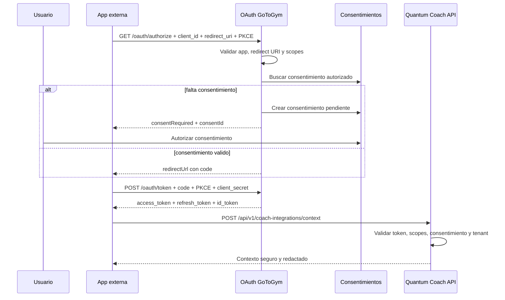

# Integraciones reales en GoToGym Developers

Fecha: 2026-06-27

## Estado funcional

La plataforma ya puede ejecutar un flujo realista de integracion:

1. Un administrador registra una aplicacion con `redirectUris`, scopes y secreto.
2. El usuario inicia OAuth Authorization Code + PKCE.
3. Si falta consentimiento, `/oauth/authorize` devuelve `consentRequired` y crea un consentimiento pendiente.
4. El usuario autoriza o rechaza desde `/api/v1/consents`.
5. Al repetir `/oauth/authorize`, se emite un authorization code.
6. La app cambia el code por access token, refresh token e id token.
7. Las APIs de Quantum Coach validan token, scopes, consentimiento, tenant y redaccion.
8. Tokens, refresh tokens, llaves, revocaciones, aplicaciones, consentimientos y auditoria persisten en JSON.

## Variables minimas de produccion

```bash
NODE_ENV=production
PORT=3000
JWT_SECRET=...
OAUTH_ISSUER=https://api.developers.gotogym.store
OAUTH_REQUIRE_CLIENT_SECRET=true
CORS_ORIGINS=https://developers.gotogym.store,https://chat.openai.com
GTG_DATA_FILE=/data/gotogym-developers-store.json
```

## Backend publico

El backend incluye `backend/Dockerfile` y endpoint:

```http
GET /health
```

Respuesta:

```json
{
  "success": true,
  "service": "gotogym-developers-api",
  "status": "ok"
}
```

## Flujo para integrar una app externa



## Limitaciones restantes

Esta version queda lista para un piloto real con backend desplegado y volumen persistente. Para escala empresarial alta conviene reemplazar el store JSON por Postgres, Redis o un managed database con migraciones, backups y bloqueo transaccional.
