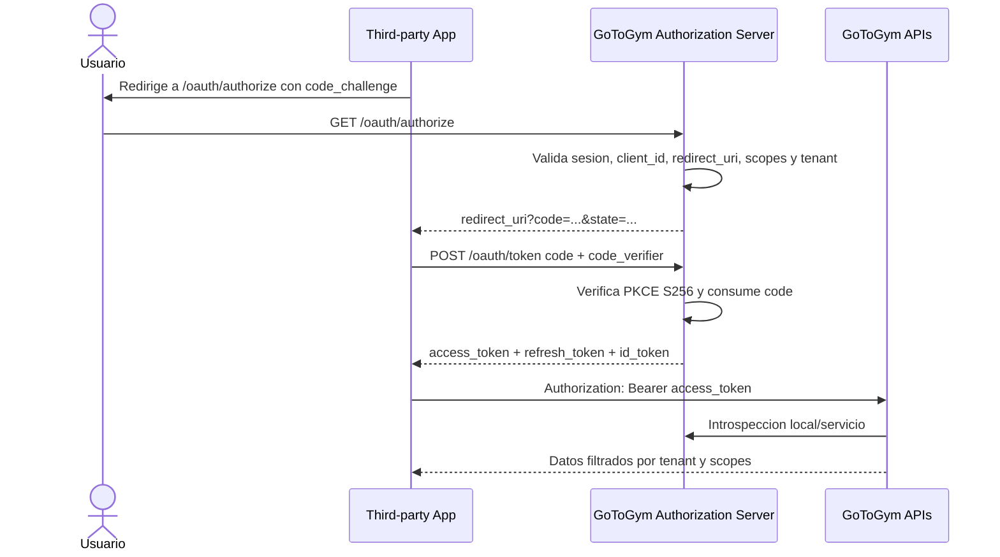
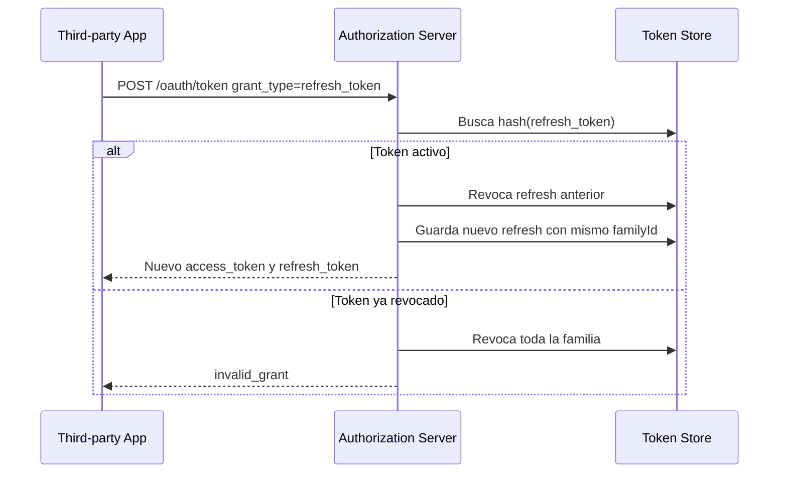
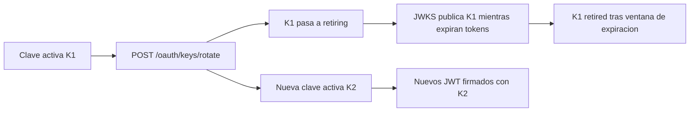

# OAuth 2.1 y OpenID Connect para GoToGym Developers

## Arquitectura

GoToGym Developers actua como Authorization Server y emisor OIDC para aplicaciones registradas en la consola.

Componentes:

- **Authorization Endpoint**: emite authorization codes ligados a `client_id`, `redirect_uri`, usuario, tenant y PKCE.
- **Token Endpoint**: intercambia `code + code_verifier` por `access_token`, `refresh_token` e `id_token`.
- **JWT Access Token**: firmado con `RS256`, incluye `tenant_id`, `organization_id`, `client_id`, `scope`, `role` y `token_use`.
- **Refresh Token rotativo**: cada uso revoca el refresh anterior y emite uno nuevo dentro de una familia.
- **Revocacion**: invalida refresh tokens o registra `jti` de access tokens revocados.
- **Introspeccion**: valida firma, expiracion, issuer, revocacion y retorna claims activos.
- **JWKS y rotacion de claves**: expone claves publicas y permite rotar la clave activa.
- **Multi-tenant**: cada token queda anclado a `tenant_id` y `organization_id`; las APIs deben filtrar datos por esos claims.

## Endpoints

| Metodo | Ruta | Descripcion |
| --- | --- | --- |
| GET | `/.well-known/openid-configuration` | Discovery OIDC. |
| GET | `/.well-known/jwks.json` | Claves publicas activas/en retiro. |
| GET | `/oauth/authorize` | Authorization Code Flow + PKCE. Requiere sesion GoToGym. |
| POST | `/oauth/token` | `authorization_code` y `refresh_token`. |
| POST | `/oauth/introspect` | Introspeccion RFC 7662. |
| POST | `/oauth/revoke` | Revocacion RFC 7009. |
| POST | `/oauth/keys/rotate` | Rotacion de clave activa. Solo `gotogym_admin`. |

## Middlewares

```ts
requireOAuthAccessToken('metrics.read')
```

Responsabilidades:

- Leer `Authorization: Bearer <access_token>`.
- Introspectar el JWT.
- Rechazar token expirado, revocado, mal firmado o con issuer invalido.
- Validar scopes requeridos por endpoint.
- Publicar `req.oauthToken` con claims multi-tenant.

## Servicios TypeScript

```txt
backend/src/models/oauth.model.ts
backend/src/repositories/oauth.repository.ts
backend/src/services/oauth.service.ts
backend/src/controllers/oauth.controller.ts
backend/src/api/routes/oauth.routes.ts
backend/src/api/middlewares/oauth.middleware.ts
```

Interfaces principales:

```ts
interface OAuthAuthorizationCode {
  code: string;
  clientId: string;
  redirectUri: string;
  codeChallenge: string;
  codeChallengeMethod: 'S256';
  scopes: DeveloperScope[];
  userId: string;
  role: AppRole;
  tenant: TenantContext;
  nonce?: string;
  expiresAt: string;
  consumedAt?: string;
}

interface OAuthRefreshToken {
  tokenHash: string;
  familyId: string;
  clientId: string;
  userId: string;
  email: string;
  role: AppRole;
  scopes: DeveloperScope[];
  tenant: TenantContext;
  expiresAt: string;
  revokedAt?: string;
  replacedByHash?: string;
}
```

## Expiracion

Valores recomendados:

- Authorization Code: 5 minutos, un solo uso.
- Access Token: 15 minutos.
- ID Token: 15 minutos.
- Refresh Token: 30 dias con rotacion y deteccion de reuse.
- Claves: activa, retiring y retired. Las retiring siguen en JWKS hasta que expiren los tokens emitidos.

## Estrategia multi-tenant

Cada token incluye:

```json
{
  "tenant_id": "tenant-gym-001",
  "organization_id": "org-gym-001",
  "client_id": "gtg_org_gym_001_portal",
  "scope": "profile.read wellbeing.read metrics.read",
  "token_use": "access"
}
```

Reglas:

- El authorization code se emite con el tenant activo del usuario.
- El refresh token conserva tenant y organizacion originales.
- La introspeccion expone `tenant_id` y `organization_id`.
- Las APIs de datos deben aplicar filtros por `organization_id` y cohortes minimas cuando sean datos agregados.
- Un `client_id` solo puede solicitar scopes autorizados para su aplicacion y rol/tenant.
- Las operaciones cross-tenant quedan reservadas a `gotogym_admin` y deben auditarse.

## Diagramas Mermaid

### Authorization Code + PKCE



### Refresh Token Rotation



### Key Rotation


