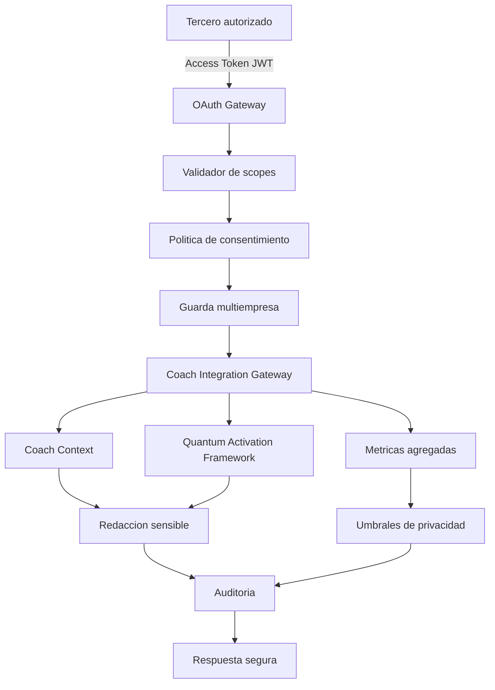
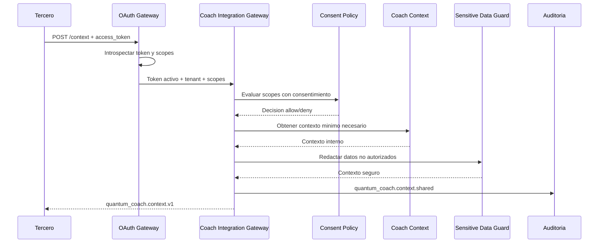
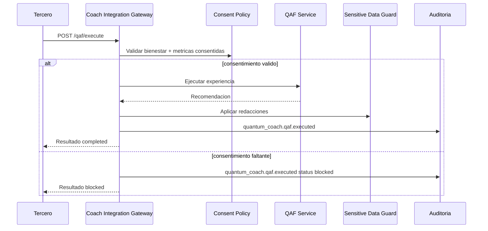
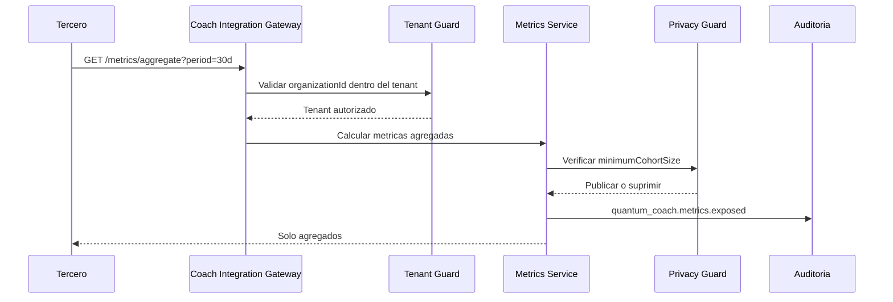

# Quantum Coach e integraciones de terceros

Fecha: 2026-06-27

## Objetivo

Quantum Coach debe interactuar con terceros por medio de una capa controlada que nunca exponga contexto crudo del usuario. La integracion debe validar OAuth 2.1/OIDC, scopes, consentimiento, tenant, politicas de redaccion y umbrales de agregacion antes de entregar contexto, ejecutar experiencias QAF o publicar metricas.

## Arquitectura



## Responsabilidades

- **OAuth Gateway:** valida access token, expiracion, revocacion, audiencia, `client_id`, `tenant_id` y scopes.
- **Coach Integration Gateway:** orquesta contexto de usuario, experiencias QAF y metricas agregadas.
- **Consent Guard:** bloquea scopes sensibles si no existen en el token autorizado por el usuario.
- **Tenant Guard:** fuerza que `tenant_id`, `organization_id` y `client_id` viajen en todos los contratos.
- **Sensitive Data Guard:** elimina identificadores, texto libre, documentos crudos y muestras sin agregacion.
- **Audit Service:** registra cada entrega de contexto, ejecucion QAF y exposicion de metricas.

## Contratos API

### `GET /api/v1/coach-integrations/capabilities`

Requiere `profile.read`.

Respuesta:

```json
{
  "success": true,
  "data": {
    "contracts": [
      "quantum_coach.context.v1",
      "quantum_coach.qaf_execution.v1",
      "quantum_coach.aggregate_metrics.v1"
    ],
    "supportedExperiences": [
      "daily_checkin",
      "habit_reinforcement",
      "recovery_guidance",
      "progress_review",
      "corporate_wellbeing_summary"
    ],
    "security": {
      "consentRequired": true,
      "aggregateOnlyMetrics": true,
      "multiTenantEnforced": true
    }
  }
}
```

### `POST /api/v1/coach-integrations/context`

Requiere `wellbeing.read`.

Request:

```json
{
  "subjectUserId": "user-001",
  "requestedScopes": ["profile.read", "wellbeing.read", "metrics.read"],
  "includeDocuments": false
}
```

Respuesta segura:

```json
{
  "success": true,
  "data": {
    "subjectUserId": "user-001",
    "tenantId": "tenant-gym-001",
    "organizationId": "org-gym-001",
    "profile": {
      "displayName": "Usuario GoToGym",
      "segment": "employee"
    },
    "wellbeing": {
      "readiness": 78,
      "stressLevel": "medium",
      "sleepQuality": "good",
      "lastCoachSummary": "Resumen sintetico disponible para experiencia QAF."
    },
    "consent": {
      "allowed": true,
      "enforced": true,
      "requiredScopes": ["profile.read", "wellbeing.read"],
      "missingScopes": []
    },
    "redactions": ["documents.rawText"]
  }
}
```

### `POST /api/v1/coach-integrations/qaf/execute`

Requiere `wellbeing.read`.

Request:

```json
{
  "subjectUserId": "user-001",
  "experienceId": "recovery_guidance",
  "inputs": {
    "sessionId": "session-2026-06-27"
  }
}
```

Respuesta:

```json
{
  "success": true,
  "data": {
    "executionId": "qaf-1782580000000",
    "experienceId": "recovery_guidance",
    "status": "completed",
    "tenantId": "tenant-gym-001",
    "organizationId": "org-gym-001",
    "subjectUserId": "user-001",
    "recommendation": {
      "title": "Ajuste de entrenamiento recomendado",
      "actions": [
        "Reducir intensidad si el estres permanece alto.",
        "Priorizar recuperacion activa durante la proxima sesion.",
        "Revisar adherencia semanal con Quantum Coach."
      ],
      "confidence": 0.82
    },
    "redactions": []
  }
}
```

### `GET /api/v1/coach-integrations/metrics/aggregate`

Requiere `analytics.read`.

Query params:

- `organizationId`: organizacion dentro del tenant autorizado.
- `period`: `7d`, `30d` o `90d`.
- `cohort`: segmento agregado. Ejemplo: `all`, `coaches`, `small-team`.

Respuesta:

```json
{
  "success": true,
  "data": {
    "tenantId": "tenant-gym-001",
    "organizationId": "org-gym-001",
    "period": "30d",
    "cohort": "all",
    "minimumCohortSize": 10,
    "metrics": {
      "activeUsers": 126,
      "averageReadiness": 76,
      "averageAdherencePercent": 71,
      "highStressPercent": 18
    },
    "privacy": {
      "aggregateOnly": true,
      "suppressed": false
    }
  }
}
```

## Diagramas de secuencia

### Obtener contexto del usuario



### Ejecutar experiencia QAF



### Exponer metricas agregadas



## Servicios TypeScript

Estructura implementada:

```text
backend/src/coach-integrations/
  controllers/
    coach-integrations.controller.ts
  routes/
    coach-integrations.routes.ts
  services/
    aggregate-metrics.service.ts
    coach-context-orchestrator.service.ts
    qaf-experience.service.ts
    sensitive-data-guard.service.ts
    third-party-consent-policy.service.ts
  types/
    coach-integration.types.ts
```

Eventos de auditoria:

- `quantum_coach.context.shared`
- `quantum_coach.qaf.executed`
- `quantum_coach.metrics.exposed`

## Estrategia de seguridad

1. **OAuth obligatorio:** todos los endpoints usan `Authorization: Bearer` y middleware de introspeccion.
2. **Scopes minimos:** contexto y QAF requieren `wellbeing.read`; metricas agregadas requieren `analytics.read`.
3. **Consentimiento por scope:** los scopes con `requiresConsent` solo se consideran disponibles si aparecen en el token autorizado.
4. **Multiempresa:** cada respuesta incluye `tenantId`, `organizationId` y `clientId` auditado; ningun tercero debe poder cruzar organizaciones.
5. **Minimizacion:** el contexto usa campos derivados, resumenes y puntuaciones; no expone muestras crudas.
6. **Redaccion:** `Sensitive Data Guard` elimina documentos, texto libre, muestras y PII cuando no hay scope.
7. **Agregacion:** metricas de empresa son `aggregateOnly` y se suprimen cuando el cohort no cumple `minimumCohortSize`.
8. **Auditoria:** toda entrega de contexto, ejecucion QAF y metrica externa queda registrada.
9. **Versionado:** contratos `quantum_coach.*.v1` permiten evolucionar campos sin romper integraciones.
10. **Rate limiting y observabilidad:** la capa debe reutilizar la infraestructura de API Gateway para trazas, logs, cache control y limites por `client_id`.

## Estado de implementacion

La primera version queda disponible en:

- `GET /api/v1/coach-integrations/capabilities`
- `POST /api/v1/coach-integrations/context`
- `POST /api/v1/coach-integrations/qaf/execute`
- `GET /api/v1/coach-integrations/metrics/aggregate`

Los servicios actuales usan datos sinteticos controlados para validar contratos. El siguiente paso de produccion es conectar `CoachContextService`, `QAFService` y `MetricsService` a los repositorios reales de AppGoToGym y Coach Context.
