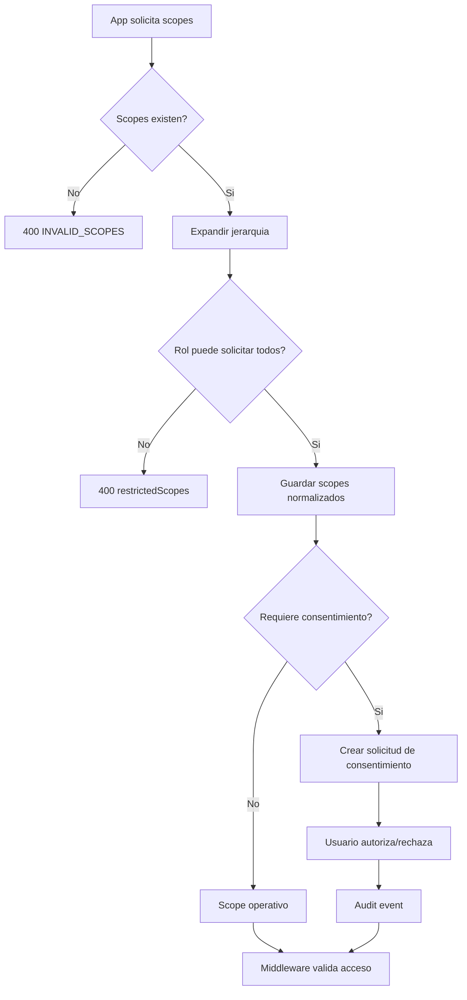
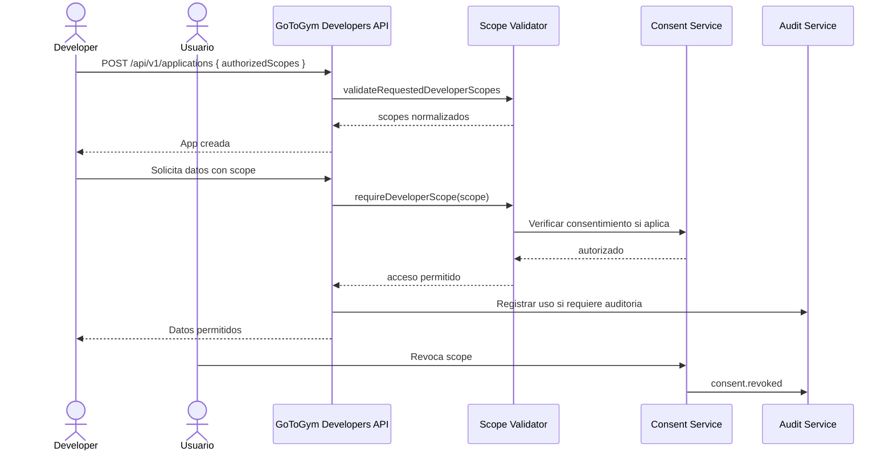

# Sistema de scopes para GoToGym Developers

## Scopes iniciales

Los scopes publicos de GoToGym Developers usan formato `dominio.accion`. La primera version define permisos de lectura para integraciones de terceros:

| Scope | Dominio | Sensibilidad | Requiere consentimiento | Requiere auditoria |
| --- | --- | --- | --- | --- |
| `profile.read` | Identidad | Baja | Si | No |
| `wellbeing.read` | Bienestar | Alta | Si | Si |
| `metrics.read` | Metricas | Alta | Si | Si |
| `analytics.read` | Analitica | Media | Si | Si |
| `organization.read` | Organizacion | Media | No | Si |
| `devices.read` | Dispositivos | Media | Si | No |
| `documents.read` | Documentos | Alta | Si | Si |

## Jerarquias

La jerarquia expande scopes de alto nivel hacia sus dependencias minimas:

| Scope solicitado | Incluye implicitamente |
| --- | --- |
| `profile.read` | Ninguno |
| `devices.read` | `profile.read` |
| `documents.read` | `profile.read` |
| `wellbeing.read` | `profile.read` |
| `metrics.read` | `profile.read`, `wellbeing.read`, `devices.read` |
| `organization.read` | Ninguno |
| `analytics.read` | `profile.read`, `wellbeing.read`, `metrics.read`, `organization.read` |

## Restricciones por rol

| Rol | Scopes permitidos |
| --- | --- |
| `end_user` | `profile.read`, `wellbeing.read`, `metrics.read`, `devices.read`, `documents.read` |
| `company_owner` | `profile.read`, `wellbeing.read`, `metrics.read`, `analytics.read`, `organization.read`, `devices.read` |
| `company_manager` | `profile.read`, `wellbeing.read`, `metrics.read`, `analytics.read`, `organization.read`, `devices.read` |
| `gotogym_admin` | Todos |
| `integrator` | `profile.read`, `wellbeing.read`, `metrics.read`, `analytics.read`, `organization.read`, `devices.read` |

`documents.read` queda restringido a usuarios finales y administradores porque expone informacion personal de alta sensibilidad.

## Validaciones

El backend centraliza las validaciones en `backend/src/types/developer-scopes.ts`:

```ts
export type DeveloperScope =
  | 'profile.read'
  | 'wellbeing.read'
  | 'metrics.read'
  | 'analytics.read'
  | 'organization.read'
  | 'devices.read'
  | 'documents.read';

export interface DeveloperScopeDefinition {
  key: DeveloperScope;
  domain: DeveloperScopeDomain;
  description: string;
  parent?: DeveloperScope;
  includes: DeveloperScope[];
  allowedRoles: AppRole[];
  internalScopes: Scope[];
  requiresConsent: boolean;
  requiresAudit: boolean;
  sensitivity: DeveloperScopeSensitivity;
}
```

Reglas:

- Rechazar scopes no incluidos en el catalogo.
- Expandir jerarquias antes de guardar una aplicacion.
- Rechazar scopes restringidos para el rol activo.
- Exigir al menos un scope valido.
- Mapear scopes publicos a permisos internos `resource:action:level` para interoperar con RBAC.
- Auditar scopes sensibles o de organizacion.
- Requerir consentimiento explicito para scopes que exponen datos personales o de salud.

## Middlewares

Los middlewares viven en `backend/src/api/middlewares/auth.middleware.ts`:

```ts
requireDeveloperScope('metrics.read')
validateRequestedDeveloperScopes(req => req.body.authorizedScopes)
```

Uso esperado:

- `requireDeveloperScope(scope)`: protege endpoints que consumen scopes publicos.
- `validateRequestedDeveloperScopes(getScopes)`: valida y normaliza scopes solicitados al crear o editar aplicaciones.
- `requireScope(scopeInterno)`: se mantiene para rutas internas RBAC ya existentes.

## Flujo Mermaid



## Secuencia de autorizacion


